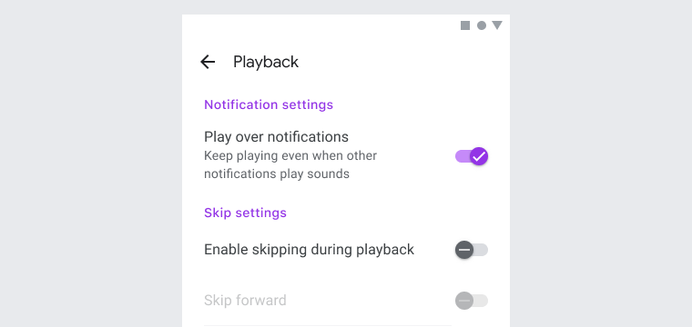

<!--docs:
title: "Switches"
layout: detail
section: components
iconId: switch
path: /catalog/input-controls/switches/
-->

# Selection controls: switches

[Selection controls](https://material.io/components/selection-controls#usage)
allow the user to select options.

Switches toggle the state of a single setting on or off. They are the preferred
way to adjust settings on mobile.



**Contents**

*   [Using switches](#using-switches)
*   [Switches](#switches)
*   [Other variants](#other-variants)
*   [API](#api)
*   [Usage within web frameworks](#usage-within-web-frameworks)

## Using switches

Use switches to:

*   Toggle a single item on or off, on mobile and tablet
*   Immediately activate or deactivate something

### Installing switches

```
npm install @material/switch
```

### Styles

```scss
@use '@material/switch/styles';
```

### JavaScript instantiation

The switch requires JavaScript to function, so it is necessary to instantiate
`MDCSwitch` on the `mdc-switch` element.

```js
import {MDCSwitch} from '@material/switch';

for (const el of document.querySelectorAll('.mdc-switch')) {
  const switchControl = new MDCSwitch(el);
}
```

**Note: See [Importing the JS component](../../docs/importing-js.md) for more
information on how to import JavaScript.**

## Switches

### Switch example

```html
<button id="basic-switch" class="mdc-switch mdc-switch--unselected" type="button" role="switch" aria-checked="false">
  <div class="mdc-switch__track"></div>
  <div class="mdc-switch__handle-track">
    <div class="mdc-switch__handle">
      <div class="mdc-switch__shadow">
        <div class="mdc-elevation-overlay"></div>
      </div>
      <div class="mdc-switch__ripple"></div>
      <div class="mdc-switch__icons">
        <svg class="mdc-switch__icon mdc-switch__icon--on" viewBox="0 0 24 24">
          <path d="M19.69,5.23L8.96,15.96l-4.23-4.23L2.96,13.5l6,6L21.46,7L19.69,5.23z" />
        </svg>
        <svg class="mdc-switch__icon mdc-switch__icon--off" viewBox="0 0 24 24">
          <path d="M20 13H4v-2h16v2z" />
        </svg>
      </div>
    </div>
  </div>
  <span class="mdc-switch__focus-ring-wrapper">
    <div class="mdc-switch__focus-ring"></div>
  </span>
</button>
<label for="basic-switch">off/on</label>
```

The `mdc-switch__focus-ring` element ensures that a focus indicator is displayed
in high contrast mode around the active/focused switch.

### Switch states

Switches can be on or off. Switches have enabled, hover, focused, and pressed
states.


## Other variants

### Initially disabled switch

Add the `disabled` attribute to the `mdc-switch` element to disable the switch.
This logic is handled by the `MDCSwitch.disabled` property, but you'll want to
avoid a FOUC by initially adding this attribute.

```html
<button id="disabled-switch" class="mdc-switch mdc-switch--unselected" type="button" role="switch" aria-checked="false" disabled>
  <div class="mdc-switch__track"></div>
  <div class="mdc-switch__handle-track">
    <div class="mdc-switch__handle">
      <div class="mdc-switch__shadow">
        <div class="mdc-elevation-overlay"></div>
      </div>
      <div class="mdc-switch__ripple"></div>
      <div class="mdc-switch__icons">
        <svg class="mdc-switch__icon mdc-switch__icon--on" viewBox="0 0 24 24">
          <path d="M19.69,5.23L8.96,15.96l-4.23-4.23L2.96,13.5l6,6L21.46,7L19.69,5.23z" />
        </svg>
        <svg class="mdc-switch__icon mdc-switch__icon--off" viewBox="0 0 24 24">
          <path d="M20 13H4v-2h16v2z" />
        </svg>
      </div>
    </div>
  </div>
  <span class="mdc-switch__focus-ring-wrapper">
    <div class="mdc-switch__focus-ring"></div>
  </span>
</button>
<label for="disabled-switch">off/on</label>
```

### Initially "on" switch

Add the `mdc-switch--selected` class and `aria-checked="true"` attribute to the
`mdc-switch` element to toggle the switch to "on". This logic is handled by the
`MDCSwitch.selected` method, but you'll want to avoid a FOUC by initially adding
this class and attribute.

```html
<button id="selected-switch" class="mdc-switch mdc-switch--selected" type="button" role="switch" aria-checked="true">
  <div class="mdc-switch__track"></div>
  <div class="mdc-switch__handle-track">
    <div class="mdc-switch__handle">
      <div class="mdc-switch__shadow">
        <div class="mdc-elevation-overlay"></div>
      </div>
      <div class="mdc-switch__ripple"></div>
      <div class="mdc-switch__icons">
        <svg class="mdc-switch__icon mdc-switch__icon--on" viewBox="0 0 24 24">
          <path d="M19.69,5.23L8.96,15.96l-4.23-4.23L2.96,13.5l6,6L21.46,7L19.69,5.23z" />
        </svg>
        <svg class="mdc-switch__icon mdc-switch__icon--off" viewBox="0 0 24 24">
          <path d="M20 13H4v-2h16v2z" />
        </svg>
      </div>
    </div>
  </div>
  <span class="mdc-switch__focus-ring-wrapper">
    <div class="mdc-switch__focus-ring"></div>
  </span>
</button>
<label for="selected-switch">off/on</label>
```

## API

### CSS classes

| CSS Class                  | Description                                    |
| -------------------------- | ---------------------------------------------- |
| `mdc-switch`               | Mandatory, for the parent element.             |
| `mdc-switch--unselected`   | Optional, styles the switch as unselected ("off") |
| `mdc-switch--selected`     | Optional, styles the switch as selected ("on") |
| `mdc-switch__track`        | Mandatory, for the track element.              |
| `mdc-switch__handle-track` | Mandatory, for the handle's track element.     |
| `mdc-switch__handle`       | Mandatory, for the handle element.             |
| `mdc-switch__shadow`       | Mandatory, for the shadow effect.              |
| `mdc-elevation-overlay`    | Mandatory, for the shadow effect's overlay in dark mode. |
| `mdc-switch__ripple`       | Mandatory, for the ripple effect.              |
| `mdc-switch__icons`        | Mandatory, for the icons.                      |
| `mdc-switch__icon`         | Mandatory, for the icon elements.              |
| `mdc-switch__icon--on`     | Mandatory, for the on icon.                    |
| `mdc-switch__icon--off`    | Mandatory, for the off icon.                   |

### Theme mixin

The switch may be customized using the `theme()` mixin and providing an
[MDC Theme](../mdc-theme) string (such as `primary`) or other values to the
theme keys.

```scss
@use '@material/switch';
@use '@material/theme/color-palette';
@use '@material/theme/shadow-dom';

// Include for IE11 support
// @include shadow-dom.enable-css-selector-fallback-declarations(true);

.my-switch {
  @include switch.theme((
    selected-handle-color: color-palette.$teal-600,
    selected-track-color: color-palette.$teal-300,
  ));
}
```

View the [theme file](_switch-theme.scss) for available keys and built-in
themes.

### `MDCSwitch` properties

| Property   | Value Type | Description                                        |
| ---------- | ---------- | -------------------------------------------------- |
| `disabled` | Boolean    | Indicates whether or not the switch is disabled.   |
| `selected` | Boolean    | If true, the switch is on. If false, the switch is off. |

## Usage within web frameworks

If you are using a JavaScript framework, such as React or Angular, you can
create a switch for your framework. Depending on your needs, you can use the
_Simple Approach: Wrapping MDC Web Vanilla Components_, or the _Advanced
Approach: Using Foundations and Adapters_. Please follow the instructions
[here](../../docs/integrating-into-frameworks.md).

See [MDCSwitchAdapter](./adapter.ts) and [MDCSwitchFoundation](./foundation.ts)
for up-to-date code documentation of switch's foundation API.
